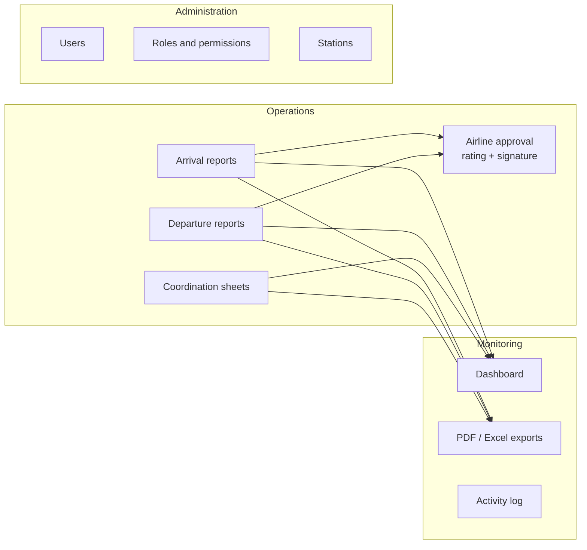
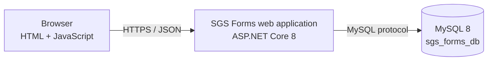

# 01 — High-Level Design (HLD)

## 1. Purpose
SGS Flight Handling Reports is a web application for ground-handling operations. Station supervisors record how each
flight was handled; the airline representative reviews the record, rates the service and signs it on screen; management
follows volumes, service quality and delays on a dashboard and exports the data to PDF and Excel.

## 2. Scope
| In scope | Out of scope |
|----------|--------------|
| Arrival and departure flight handling reports | Flight schedules or live flight data feeds |
| Coordination sheets (turnaround time chart) | Integration with airline or airport systems |
| Airline approval with satisfaction rating and signature | E-mail / SMS notifications |
| Return-for-correction workflow | Billing or invoicing |
| Dashboard, PDF and Excel exports | Mobile native apps (the web UI is responsive) |
| Users, roles, permissions and stations administration | Single sign-on (users sign in with e-mail and password) |
| Activity (audit) log | |

## 3. Users and roles
Roles are data, not code: administrators can create roles and tick any of the 19 permissions. Three roles are created
on a new database:

| Role | Typical user | Main permissions |
|------|--------------|------------------|
| `admin` (locked system role) | IT / system owner | All 19 permissions |
| `management` | Operations management | Lists of pending, returned, approved reports; dashboard; exports; all stations |
| `data_entry` ("Handling Supervisor") | Station supervisor | Create, edit, delete reports; coordination sheets; approval screen; exports |

Station scoping: a user assigned to a station sees only that station's data. A user without a station and with the
`stations.viewAll` permission sees every station.

## 4. Functional modules

| Module | Description |
|--------|-------------|
| Arrival / Departure reports | Flight details, times, passengers by class, baggage by type, boarding, delays (code, reason, minutes), staff productivity, remarks. Saved as draft or submitted for approval. |
| Coordination sheet | Arrival and departure flight of a turnaround, handling type, 24-activity time chart (actual start/finish), buses, delay, GAIN time. |
| Airline approval | The airline representative reviews a submitted report, gives a 1–5 rating and signs, or returns it with a reason. |
| Lists | Pending approval, drafts, returned, approved, coordination — search, filters and paging (50 rows per page). |
| Dashboard | Totals by status, trend over time, by station, by airline, satisfaction distribution, latest approved reports. |
| Exports | PDF per report / coordination sheet; Excel for a chosen selection (type, status, period, airline, station, search). |
| Administration | Users, roles (permission matrix), stations. |
| Activity log | Every create, update, submit, approve, return and delete, with user, station and time. |

## 5. Architecture overview
A single ASP.NET Core application serves both the web pages and the REST API; data is stored in MySQL.

Details: document 03 (solution), 04 (infrastructure), 05 (network), 06 (integrations).

## 6. Technology
| Layer | Technology |
|-------|------------|
| User interface | Static HTML5, CSS and vanilla JavaScript (15 pages + shared `nav.js`), Chart.js 4.4.1, Arabic / English, RTL / LTR |
| Application | ASP.NET Core 8 Web API (.NET 8.0.18 runtime), Kestrel web server |
| Data access | Entity Framework Core 8.0.10, Pomelo MySQL provider 8.0.2, MySqlConnector 2.3.5 |
| Security | JWT bearer tokens (HS256), BCrypt password hashing (BCrypt.Net-Next 4.0.3), permission-based authorisation |
| Documents | PDFsharp / MigraDoc 6.2.4 (PDF), ClosedXML 0.104.1 (Excel) |
| Database | MySQL 8.0, InnoDB, utf8mb4 |
| API documentation | Document 02 (the Swagger page was removed from production builds to reduce attack surface) |

## 7. Quality attributes
| Attribute | How it is achieved |
|-----------|--------------------|
| Security | Hashed passwords, signed tokens re-checked against the database on every request, permission checks on every endpoint, station isolation, input validation, output escaping, security headers, login rate limiting. See document 12. |
| Performance | Measured on the development machine: about 700 list-page requests/s and 4,000 single-report requests/s; dashboard 8 ms for 30 days and ≈0.4 s for 100,000 reports. See document 09. |
| Scalability | Stateless application (the token carries the session), so more application instances can be added behind a load balancer. |
| Availability | Single server today; recommendations in document 04. |
| Auditability | Activity log of every change; approvals keep rating, representative and signature image. |
| Usability | Bilingual UI, responsive layout, per-permission menus. |
| Maintainability | Layered code (controllers → services → data), one place for each rule (permissions, parsing, flight codes). |

## 8. Constraints and assumptions
- Windows is the reference platform (PDF rendering uses the Windows fonts).
- MySQL 8 is required; the schema is created and upgraded by EF Core migrations at start-up.
- Users reach the system from a browser on the company network or over HTTPS through a reverse proxy.
- The source was recovered from the deployed build (decompiled). Original comments were lost; code has since been reviewed and cleaned (document 12).
