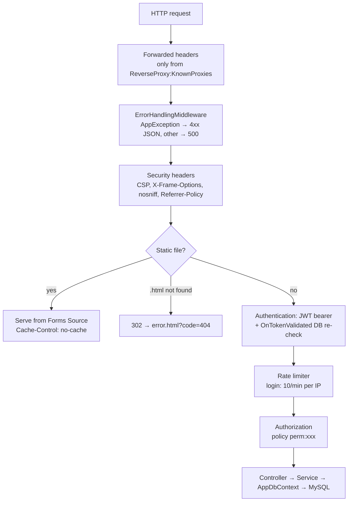
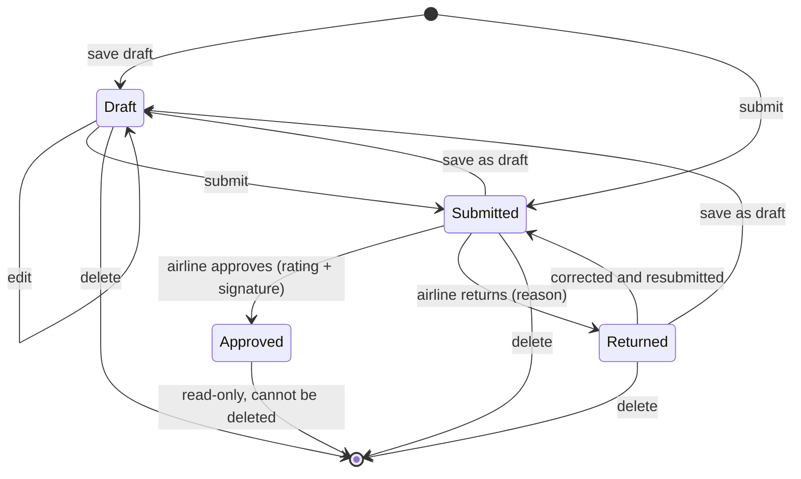

# 02 — Low-Level Design (LLD)

## 1. Source layout
```
Decompiled Source/
├── SGSForms.Api/
│   ├── Program.cs                  start-up: services, security, middleware pipeline
│   ├── appsettings.json            non-secret settings (secrets: appsettings.Production.json or env vars)
│   ├── Forms Source/               the web UI (static files served by the application)
│   └── SGSForms/Api/
│       ├── Controllers/            12 REST controllers (thin: routing + authorisation)
│       ├── Services/               business rules, one service per module
│       ├── Auth/                   JWT, current user, permission catalogue and policies
│       ├── Data/                   AppDbContext (EF Core model), DbSeeder
│       ├── Entities/               15 database entities
│       ├── Dtos/                   request / response contracts
│       ├── Enums/                  ReportStatus, ReportKind, ApprovalDecision, BoardingMode
│       ├── Middleware/             ErrorHandlingMiddleware (errors → JSON {detail})
│       └── Migrations/             EF Core migrations (9)
├── lib/                            third-party assemblies referenced by the project
└── SQL Deploy/                     database creation scripts and deployment guide
```

## 2. Request pipeline (Program.cs)


## 3. Components
| Component | Responsibility |
|-----------|----------------|
| `JwtTokenService` | Issues tokens (claims: user id, name, role, station, permissions, security stamp); validates the signing key (≥ 32 bytes). |
| `OnTokenValidated` (Program.cs) | On every request: user must exist and be active, role active, security stamp equal to SHA-256(password hash); rebuilds the permissions from the database, so changes apply immediately. |
| `PermissionPolicyProvider` / `PermissionHandler` | Turns `[Authorize(Policy = "perm:x")]` into a permission check. |
| `CurrentUser` | Id, name, role, station, permissions of the caller; `CanAccessStation`, `StationScope`. |
| `AuthService` | Login: constant-time failure path, BCrypt verification, last-login update, token. |
| `ArrivalService`, `DepartureService`, `CoordinationService` | Create / update / read / delete forms; validation; status transitions. |
| `ReportService` | Paged lists of arrival + departure reports by status. |
| `ApprovalService` | Approve (rating, representative, signature) or return (reason). |
| `DashboardService` | Aggregates for a period. |
| `ExportService` | PDF (MigraDoc) and Excel (ClosedXML) for reports and coordination sheets. |
| `AdminService`, `RoleService` | Users, stations, roles; escalation guard; "at least one role administrator" guard. |
| `AuditService` | Writes the activity log after each change (never blocks the change). |
| `Parse`, `FlightNo`, `ReportRules`, `CoordinationActivities` | Shared rules: input parsing and limits, airline designator, station resolution, activity catalogue. |

## 4. REST API
All endpoints except login require a valid bearer token. "Permission" is the policy on the endpoint; services add
station checks (`CanAccessStation` / `StationScope`) and, where noted, further permission checks.

| Method | Route | Permission | Notes |
|--------|-------|------------|-------|
| POST | `/auth/login` | anonymous, rate-limited | Form fields `username`, `password` → token and profile |
| GET | `/reports?status&from&to&stationId&airline&q&page&pageSize` | list permission of the status* | Arrivals + departures, max 50 per page |
| POST | `/reports/{kind}/{id}/return` | `reports.approve` | Body `{reason}`; only submitted reports |
| POST / PUT | `/arrival`, `/arrival/{id}` | `reports.create` | Save draft or submit |
| GET | `/arrival/{id}` | any report-reading permission** | |
| DELETE | `/arrival/{id}` | `reports.delete` | Not allowed once approved |
| POST / PUT / GET / DELETE | `/departure[...]` | same as arrival | |
| POST | `/approvals` | `reports.approve` | `{kind, reportId, satisfaction 1–5, airlineRemarks, rep{name, airline, position}, signature}` |
| GET | `/approvals/{kind}/{id}` | any report-reading permission** | Latest decision |
| GET | `/coordination?status&from&to&stationId&airline&q&page&pageSize` | `coordination.view` or `.create` | |
| POST / PUT | `/coordination`, `/coordination/{id}` | `coordination.create` | |
| GET | `/coordination/{id}` | `coordination.view` or `.create` | |
| DELETE | `/coordination/{id}` | `coordination.delete` | |
| GET | `/dashboard/summary?from&to&stationId&airline` | `dashboard.view` | |
| GET | `/export/report/{kind}/{id}/pdf` | `export.pdf` + report reading | |
| GET | `/export/coordination/{id}/pdf` | `export.pdf` + coordination view | |
| GET | `/export/reports.xlsx`, `/export/reports/count` | `export.excel` + list permission per status | `status` (comma list or `all`), `kind`, period, airline, station, `q` |
| GET | `/export/coordination.xlsx`, `/export/coordination/count` | `export.excel` + coordination view | `status`, `handling`, period, airline, station, `q` |
| GET | `/logs?action&kind&date&q&page&pageSize` | `logs.view` | |
| GET | `/stations?includeInactive` | authenticated | Inactive ones only for `admin.stations` |
| POST / PUT / DELETE | `/stations[...]` | `admin.stations` | Delete refused while referenced |
| GET / POST / PUT / DELETE | `/users[...]` | `admin.users` | Escalation guard (§7) |
| GET | `/roles` | `admin.roles` or `admin.users` | |
| GET | `/roles/permissions` | `admin.roles` | Permission catalogue |
| POST / PUT / DELETE | `/roles[...]` | `admin.roles` | Locked role keeps its permissions |

\* draft → `reports.drafts`, submitted → `reports.pending`, returned → `reports.returned`, approved → `reports.approved`.
\** any of `reports.view`, `reports.create`, `reports.approve`, `reports.pending`, `reports.drafts`, `reports.returned`, `reports.approved`, `dashboard.view`.

Errors are returned as `{"detail": "<message>"}` with 400 (invalid input), 401, 403, 404, 409 (conflicting state), 429 (too many logins) or 500.

## 5. Permission catalogue
| Group | Permissions |
|-------|-------------|
| Reports | `reports.view`, `reports.create`, `reports.delete`, `reports.approve` |
| Lists | `reports.pending`, `reports.drafts`, `reports.returned`, `reports.approved` |
| Coordination | `coordination.view`, `coordination.create`, `coordination.delete` |
| Export | `export.pdf`, `export.excel` |
| Monitoring | `dashboard.view`, `logs.view` |
| Administration | `admin.users`, `admin.roles`, `admin.stations` |
| Scope | `stations.viewAll` |

## 6. Report life cycle

Coordination sheets use Draft and Submitted ("Completed") only.

## 7. Business rules
| Area | Rule |
|------|------|
| Station | A form is filed under the requested station (if the user may access it) or the user's own station; the station must exist and be active. |
| Approval | Only a *Submitted* report can be approved or returned (prevents double approval and approving drafts). Rating 1–5; representative name and airline required; signature must be a PNG/JPEG data URL (≤ 2 MB). |
| Totals | Departure passenger total = F + J + W + Y + Hajj + Altanfeethi + VIP (infants excluded); baggage total = sum of all baggage types. |
| GAIN time | STD − ATD in minutes, never negative, not computed for terminating flights. |
| Drafts | Marked with an expiry of creation + 24 h (shown as "hours left"); drafts are not deleted automatically. |
| Users | A manager without `admin.roles` can only create or edit users whose role permissions are all held by the manager (no self-promotion to administrator). Users cannot change their own role or deactivate themselves. At least one active user must keep `admin.roles`. Password ≥ 8 characters. |
| Roles | Key `^[a-z][a-z0-9_]{1,39}$`, colour `#RRGGBB`, names ≤ 80 characters. System roles cannot be deleted; roles in use cannot be deleted. |
| Airline code | IATA two-character designators including digits (SV, XY, F3, 6E) and three-letter ICAO designators followed by a number (SVA123). Same rule in the server (`FlightNo.Prefix`) and the pages (`SGS.airlineCode`). |
| Paging | At most 50 rows per page (enforced by the server). Search term ≤ 50 characters. |
| Excel export | At most 20,000 records per file; larger selections are refused with a message to narrow the period or filters (the dialog shows the count first). |
| Input limits | Counts 0–100,000; lists ≤ 100 items; flight number ≤ 20; route ≤ 100; remarks ≤ 2,000; delay reason ≤ 500 characters. Invalid dates and times are rejected. |

## 8. Front-end design
| File | Role |
|------|------|
| `nav.js` | Session check, side menu by permission, `SGS.esc` (HTML escaping), `SGS.can`, shared pager, export dialog, airline code rule, notifications |
| `index.html` | Login |
| `main.html` | Home: create report / sheet, counters |
| `report_form.html` | Arrival / departure form |
| `airline_approval.html` | Review, rating, signature pad, return; read-only view of approved reports |
| `pending.html`, `drafts.html`, `returned.html`, `approved.html` | Lists with search, filters, paging, Excel export |
| `coordination.html`, `coordination_form.html`, `coordination_view.html` | Coordination list, form, read-only view |
| `dashboard.html` | Charts and KPIs |
| `admin.html` | Users, roles, stations |
| `logs.html` | Activity log |
| `error.html` | Friendly error page |

The token and profile are kept in `localStorage`; every API call sends `Authorization: Bearer <token>`. A 401 response
clears the session and returns to the login page. All data inserted into the page is HTML-escaped.
