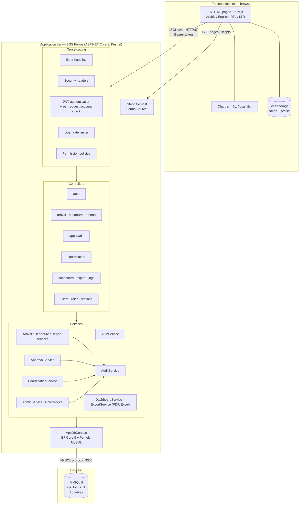

# 03 — Solution Architecture Diagram

The solution is a three-tier web application packaged as one deployable: the ASP.NET Core process serves the user
interface (static files) and the REST API, and persists data in MySQL.

## Component responsibilities
| Tier | Component | Responsibility |
|------|-----------|----------------|
| Presentation | Pages | Forms, lists, dashboard, administration; call the API with `fetch` |
| Presentation | `nav.js` | Menu by permission, escaping, paging, export dialog, notifications |
| Application | Cross-cutting middleware | Error mapping, headers, authentication, rate limiting, authorisation |
| Application | Controllers | Routes and endpoint permissions |
| Application | Services | Validation, business rules, station isolation, audit |
| Application | AppDbContext | Object-relational mapping, migrations |
| Data | MySQL | Persistent storage of forms, approvals (including signatures), users, roles, audit log |

## Design decisions
| Decision | Reason |
|----------|--------|
| One process for UI and API | Simple deployment, no cross-origin configuration (CORS is disabled) |
| Stateless bearer tokens | No server session store; scales horizontally |
| Per-request account check | Deactivation, password change and permission change take effect immediately |
| Permissions instead of role names | Administrators can define new roles without code changes |
| Documents generated on the server | Consistent PDF / Excel layout; permission and station checks apply to exports |
