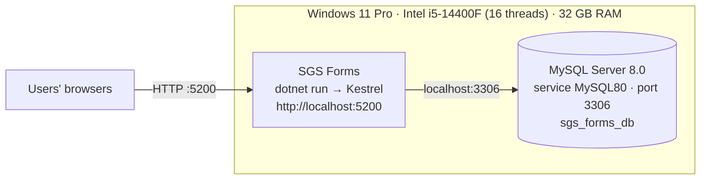
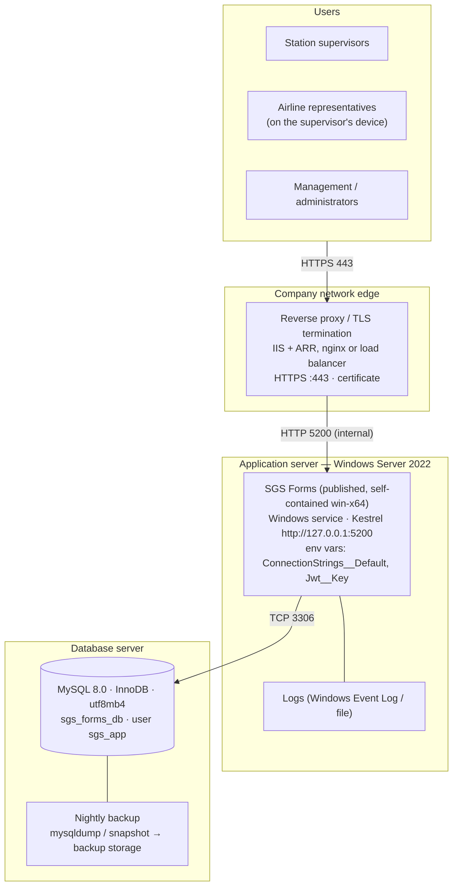

# 04 — Infrastructure Architecture Diagram

## 1. Current installation (development / pilot)
Everything runs on one Windows PC. The application is started from `run.bat` (`dotnet run`, Debug build) and stops
when that window is closed.

## 2. Recommended production deployment

## 3. Components
| Component | Specification |
|-----------|---------------|
| Application runtime | .NET 8 (8.0.18); published self-contained so no .NET install is needed on the server |
| Web server | Kestrel inside the application, behind a reverse proxy that provides HTTPS |
| Process management | Windows service or scheduled task with automatic restart (see `install-service.ps1` of the original package) |
| Database | MySQL Community / Enterprise 8.0, InnoDB, utf8mb4 |
| Secrets | Machine environment variables `ConnectionStrings__Default` and `Jwt__Key` (or `appsettings.Production.json` with restricted file permissions) |
| Backups | Daily full backup of `sgs_forms_db`; keep at least 30 days; test a restore quarterly |
| Monitoring | Windows service state, HTTP check of `/index.html`, disk space of the database volume |

## 4. Environments
| Environment | Database | Demo accounts |
|-------------|----------|---------------|
| Test / UAT | separate database (e.g. `sgs_forms_test`) | Optional: `Seed__DemoUsers=true` |
| Production | `sgs_forms_db` / `sgs_forms_prod` | Never — first administrator via `SQL Deploy/02_seed_production.sql` |

## 5. Availability options
| Level | Setup | Result |
|-------|-------|--------|
| Basic (current design) | One application server + one database server + nightly backup | Restart-on-failure; restore from backup after a server loss |
| Improved | Two application instances behind the load balancer; MySQL replica | Survives loss of one application server; faster database recovery |

Note for more than one application instance: the login rate limit is kept in memory per instance, and all instances
must share the same `Jwt__Key`.
