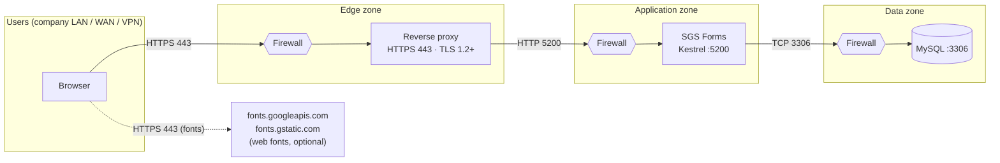

# 05 — Network Architecture Diagram

## Ports and flows
| # | From | To | Port / protocol | Purpose | Required |
|---|------|----|-----------------|---------|----------|
| 1 | User browser | Reverse proxy | 443 / HTTPS | Pages and API | Yes |
| 2 | Reverse proxy | Application server | 5200 / HTTP (internal only) | Forward requests | Yes |
| 3 | Application server | Database server | 3306 / MySQL | Data access | Yes |
| 4 | User browser | Google Fonts | 443 / HTTPS | Tajawal and DM Mono fonts | Optional — pages fall back to system fonts |
| 5 | Administrators | Database server | 3306 / MySQL | Administration, backups | From the admin network only |

The application makes **no outbound calls** of its own.

## Firewall rules
| Rule | Source | Destination | Port | Action |
|------|--------|-------------|------|--------|
| Users to proxy | User networks | Reverse proxy | 443 | Allow |
| Proxy to application | Reverse proxy | Application server | 5200 | Allow |
| Application to database | Application server | Database server | 3306 | Allow |
| Direct access to 5200 | Any other source | Application server | 5200 | Deny |
| Direct access to 3306 | Any other source | Database server | 3306 | Deny |
| Everything else | Any | Any | Any | Deny |

## Settings that depend on the network
| Setting | Value |
|---------|-------|
| `Urls` (appsettings.json) | `http://127.0.0.1:5200` when a reverse proxy is on the same server; `http://0.0.0.0:5200` only when the proxy is on another host and the firewall restricts the source |
| `AllowedHosts` | The public host name, e.g. `reports.company.com` (currently `*`) |
| `ReverseProxy:KnownProxies` | The reverse proxy address(es); only these may set `X-Forwarded-For` (real client address for logging and the login limit) |
| MySQL user | `sgs_app` limited to `localhost` or the application server's address (the script now creates it for `localhost`) |
| MySQL bind address | The database server's internal address, never a public interface |

## Security on the wire
- HTTPS terminates at the reverse proxy; the proxy-to-application hop stays on the internal network.
- The application sends `Content-Security-Policy`, `X-Frame-Options: DENY`, `X-Content-Type-Options: nosniff`,
  `Referrer-Policy: no-referrer` and a restrictive `Permissions-Policy`.
- Once HTTPS is in place, add `Strict-Transport-Security` at the reverse proxy.
