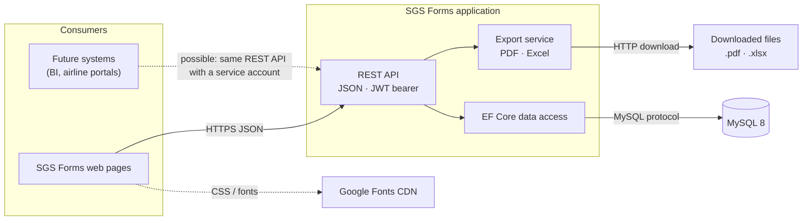

# 06 — Integration Architecture Diagram

SGS Forms is a self-contained system: it has **no integrations with airline, airport or enterprise systems** today.
Its interfaces are the browser-facing REST API, the database and file exports.

## Interface catalogue
| ID | Interface | Direction | Protocol / format | Authentication | Notes |
|----|-----------|-----------|-------------------|----------------|-------|
| INT-01 | REST API | Browser → application | HTTPS, JSON | JWT bearer (login with e-mail + password) | Endpoints listed in document 02 |
| INT-02 | Login | Browser → application | HTTPS, form-urlencoded | None (rate-limited) | Returns token + profile + permissions |
| INT-03 | Database | Application → MySQL | MySQL protocol (MySqlConnector) | MySQL user / password | EF Core; migrations applied at start-up |
| INT-04 | PDF export | Application → user | `application/pdf` | JWT + `export.pdf` | Report and coordination sheet |
| INT-05 | Excel export | Application → user | `.xlsx` (OpenXML) | JWT + `export.excel` | Arrival / departure / coordination sheets |
| INT-06 | Web fonts | Browser → Google | HTTPS, CSS | None | Optional; no user data is sent |

## Integration guidelines for future systems
| Need | Recommended approach |
|------|----------------------|
| Read reports into BI | A read-only MySQL user on a replica, or a new read-only API endpoint |
| Push flights from an airport system | New endpoint protected by a dedicated permission and a service account |
| Single sign-on | Add an OpenID Connect provider in front of the existing permission model |
| Notifications | Outbound e-mail / webhook service triggered from the audit events |

Any external caller uses the same permission model; a dedicated role with only the needed permissions should be created
for it.
