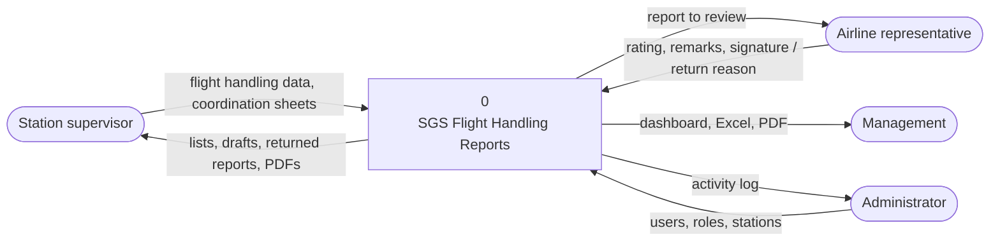
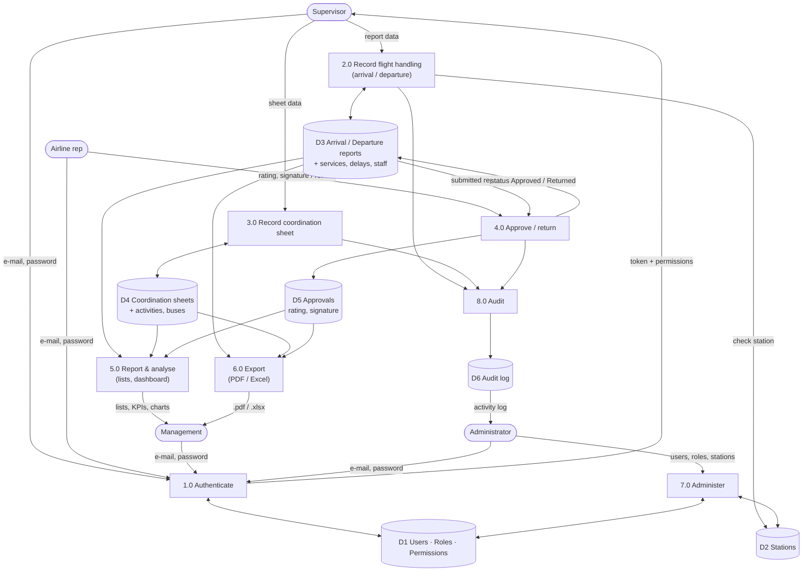
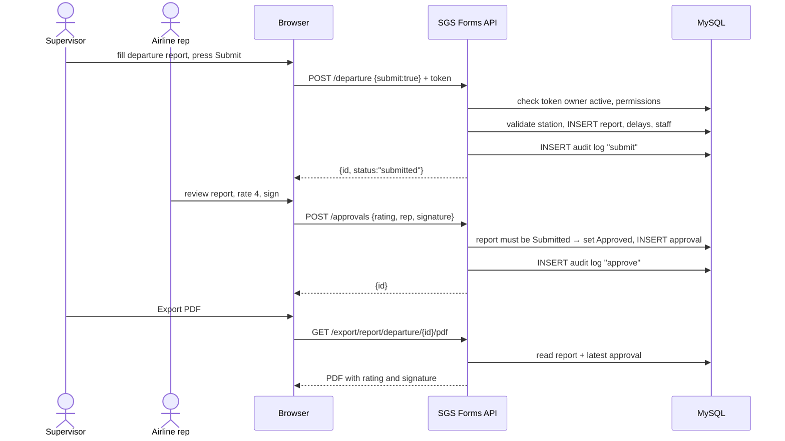

# 07 — Data Flow Diagram

## Level 0 — context

## Level 1 — processes and data stores

## Sequence — submit, approve, export

## Data classification
| Data | Store | Sensitivity | Protection |
|------|-------|-------------|------------|
| Passwords | D1 `users.PasswordHash` | Secret | BCrypt hash only; never returned by the API |
| Signatures | D5 `approvals.SignatureImage` | Personal | Visible only to users with report access for that station |
| Operational flight data | D3, D4 | Internal | Permission + station checks |
| Audit log | D6 | Internal | `logs.view` only; written by the server, not editable from the UI |
