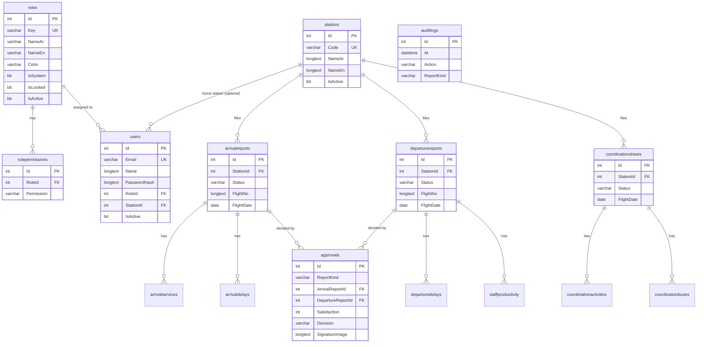

# 08 — Database Design Document

| Item | Value |
|------|-------|
| Engine | MySQL 8.0, InnoDB |
| Database | `sgs_forms_db` |
| Character set | utf8mb4 (Arabic text), tables use `utf8mb4_0900_ai_ci` (case- and accent-insensitive comparisons) |
| Tables | 15 application tables + `__efmigrationshistory` |
| Schema management | EF Core code-first migrations, applied automatically at start-up; `SQL Deploy/01_schema.sql` creates the same schema manually |
| Migrations | InitialCreate (2026-06-18), AddArrivalBaggageAndAuditLog, RenameStaffCountToPaxExec, AddPaxVip, AddReportListIndex, AddCoordinationSheets, DropCoordSvTcToc, SimplifyCoordActivities, DynamicRolesAndPermissions (2026-08-19) |

## 1. Entity-relationship diagram

`auditlogs` has no foreign keys on purpose: log entries survive deletion of the report, user or station they mention.

## 2. Tables
Type notation: `?` = nullable. All `Id` columns are `int AUTO_INCREMENT` primary keys. Times are stored in UTC.

### Security and reference data
| Table | Columns |
|-------|---------|
| `roles` | Id, Key varchar(40) **unique**, NameAr varchar(80), NameEn varchar(80), Color varchar(20), IsSystem bit, IsLocked bit, IsActive bit, CreatedAt datetime(6) |
| `rolepermissions` | Id, RoleId → roles (cascade), Permission varchar(60); **unique (RoleId, Permission)** |
| `users` | Id, Name, Email varchar(255) **unique**, PasswordHash (BCrypt), RoleId → roles (restrict), StationId? → stations (set null), IsActive bit, LastLogin? datetime(6), CreatedAt, UpdatedAt |
| `stations` | Id, Code varchar(255) **unique** (IATA, 3 letters), NameAr, NameEn, IsActive bit, CreatedAt |

### Flight handling reports
| Table | Columns |
|-------|---------|
| `arrivalreports` | Id, StationId → stations (restrict), Status varchar(20) (Draft / Submitted / Approved / Returned), FlightNo, Route, AircraftReg?, FlightDate date, Sta?, Ata?, SupervisorName?, ReportTime?, GateNo?, GateOpen?, GateClose?, FirstPaxTime?, LastPaxTime?, TtlPaxArr, TtlWchr, PaxVip, BagTotal, ActualPax, NoShow, Offloaded, Remarks?, CreatedByUserId, CreatedAt, UpdatedAt, SubmittedAt?, DraftExpiresAt? |
| `arrivalservices` | Id, ArrivalReportId → arrivalreports (cascade), Name, Count |
| `arrivaldelays` | Id, ArrivalReportId → arrivalreports (cascade), Code?, Reason?, DurationMinutes |
| `departurereports` | Id, StationId → stations (restrict), Status, FlightNo, Route, AircraftReg?, FlightDate, Std?, Atd?, CounterNo?, CountersStartedAt?, SupervisorName?, ReportTime?, PaxExec, PaxF, PaxJ, PaxW, PaxY, PaxInf, PaxHajj, PaxVip, PaxTotal, BagNormal, BagWchr, BagCbbg, BagStcr, BagAvih, BagVip, BagZamzam, BagHajj, BagTotal, ExcessTickets, ExcessSales decimal(12,2), BoardingGate?, BoardingMode? (Jetway / Bus), BoardingStarted?, BoardingCompleted?, GateOpened?, GateClosed?, TotalBuses, SpecialHandling?, ActualPax, NoShow, Offloaded, Remarks?, CreatedByUserId, CreatedAt, UpdatedAt, SubmittedAt?, DraftExpiresAt? |
| `departuredelays` | Id, DepartureReportId → departurereports (cascade), Code?, Reason?, DurationMinutes |
| `staffproductivity` | Id, DepartureReportId → departurereports (cascade), StaffName, PassengersServed, Comments? |
| `approvals` | Id, ReportKind varchar(20), StationId, ArrivalReportId? → arrivalreports (cascade), DepartureReportId? → departurereports (cascade), Satisfaction (1–5; 0 for returns), AirlineRemarks?, AirlineRepName, AirlineCompany, AirlineRepPosition?, SignatureImage? (base64 data URL, longtext), Decision (Approved / Returned), ReturnReason?, ApprovedByUserId, ApprovedAt datetime(6) |

### Coordination sheets
| Table | Columns |
|-------|---------|
| `coordinationsheets` | Id, StationId → stations (restrict), Status (Draft / Submitted), FlightDate, AcType?, AcReg?, ArrFlightNo?, ArrFrom?, ArrPaxF/J/Y, DepFlightNo?, DepTo?, DepPaxF/J/Y, Turnaround bit, Transit bit, Terminating bit, Originating bit, Sta?, Ata?, Std?, Atd?, GainTime?, DlyAmount (minutes), DelayCode?, SupervisorName?, ReportTime?, Remarks?, CreatedByUserId, CreatedAt, UpdatedAt, SubmittedAt?, DraftExpiresAt? |
| `coordinationactivities` | Id, CoordinationSheetId → coordinationsheets (cascade), ActivityKey varchar(40) (one of 24 keys), ActualStart?, ActualFinish?, Remarks? |
| `coordinationbuses` | Id, CoordinationSheetId → coordinationsheets (cascade), Phase varchar(10) (arrival / departure), BusNo?, Time? |

### Audit
| Table | Columns |
|-------|---------|
| `auditlogs` | Id, At datetime(6), UserId?, UserName, UserRole, StationId?, StationCode?, Action varchar(20) (create / update / submit / approve / return / delete), ReportKind varchar(20) (arrival / departure / coordination), ReportId?, FlightNo?, Details? |

## 3. Indexes
| Table | Index | Used by |
|-------|-------|---------|
| arrivalreports, departurereports, coordinationsheets | (StationId, Status), (Status, FlightDate), (FlightDate) | Lists by status, station and date; dashboard |
| approvals | (ArrivalReportId), (DepartureReportId), (ReportKind, ArrivalReportId, DepartureReportId) | Latest decision of a report |
| auditlogs | (At) | Activity log ordered by time |
| users | Email unique, (StationId), (RoleId) | Login, joins |
| child tables | FK column | Loading a report with its rows |

## 4. Integrity rules
| Rule | Enforcement |
|------|-------------|
| A station with users or reports cannot be deleted | Application check (409) + FK `RESTRICT` |
| A role in use cannot be deleted | Application check + FK `RESTRICT` |
| Deleting a report deletes its services, delays, staff rows and approvals | FK `CASCADE` |
| Deleting a coordination sheet deletes its activities and buses | FK `CASCADE` |
| Approved reports cannot be edited or deleted | Application rule |
| E-mail, station code, role key are unique | Unique indexes |

## 5. Volume estimates
Measured on the current database (September 2026): report rows are about 2–3 KB each including child rows; the
dominant item is the signature image stored with each approval — **average 37 KB, largest 111 KB** (13 approvals).

| Volume assumption | Reports per year | Approvals with signature | Approx. growth per year |
|-------------------|------------------|--------------------------|-------------------------|
| 50 reports / day, half approved | ≈ 18,000 | ≈ 9,000 | ≈ 50 MB rows + ≈ 330 MB signatures ≈ **0.4 GB** |
| 200 reports / day, half approved | ≈ 73,000 | ≈ 36,500 | ≈ 200 MB rows + ≈ 1.3 GB signatures ≈ **1.5 GB** |

Indexes and InnoDB overhead add roughly 30–50 %. Backups compress well except for the signature images.

## 6. Accounts
| Account | Rights | Use |
|---------|--------|-----|
| `root` | Everything | Installation only; must not be used by the application |
| `sgs_app` (from `00_create_database.sql`) | SELECT, INSERT, UPDATE, DELETE, CREATE, ALTER, INDEX, DROP, REFERENCES on `sgs_forms_db` | Application (needs DDL rights because migrations run at start-up) — restrict its host to the application server |
