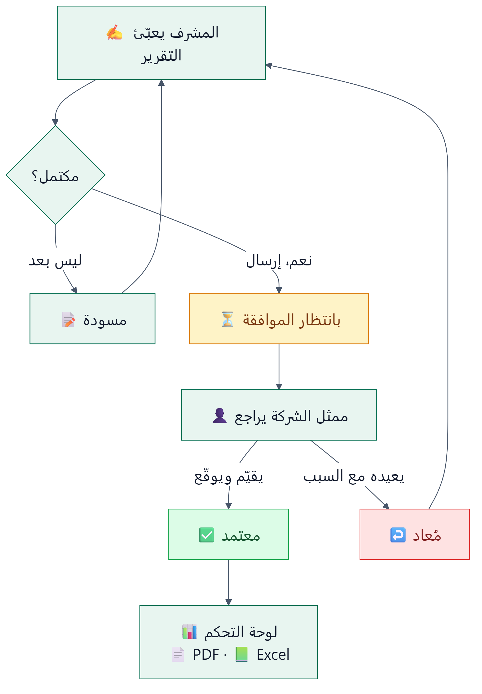
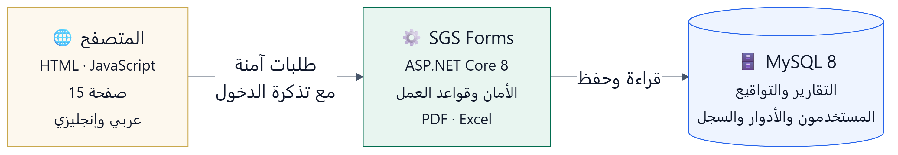

[English](README.md) | **العربية**

# منظومة تقارير مناولة الرحلات — SGS Flight Handling Reports

نظام ويب يوثّق كيف تمت مناولة كل رحلة في المطار، من لحظة وصول الطائرة إلى إقلاعها، ويجمع توقيع شركة الطيران
على التقرير بدل الورق، ثم يحوّل هذه التقارير إلى أرقام ولوحات متابعة يستفيد منها المسؤولون.

---

## الفكرة ببساطة

تخيّل مشرف المناولة في مطار الرياض. هبطت رحلة، انتهت المناولة، وقبل أن يغادر يفتح النظام من جهازه ويسجّل ما حدث:
أوقات الوصول والإقلاع، عدد الركاب في كل درجة، الحقائب بأنواعها، الكراسي المتحركة، البوابة، الحافلات، وأي تأخير
وسببه. يحفظ التقرير مسودةً إن لم يكتمل، أو يرسله مباشرة.

بعدها يأتي ممثل شركة الطيران، يراجع التقرير على نفس الجهاز، يقيّم الخدمة من نجمة إلى خمس نجوم، ويوقّع بإصبعه على
الشاشة. إن وجد خطأ يعيد التقرير للمشرف مع سبب الإرجاع، فيصححه ويرسله من جديد.

وفي الجهة الأخرى، ترى الإدارة كل هذا مجمّعاً: كم رحلة خُدمت، كم تقرير ينتظر الاعتماد، ما مستوى رضا شركات
الطيران، وأي محطة أو شركة تستحق الانتباه — وتنزّل ما تريد إلى Excel أو PDF.

<p align="center">
  
</p>

---

## ماذا يوجد في النظام؟

**تقارير الوصول والمغادرة** — قلب النظام. نموذج لكل رحلة بتفاصيل الركاب والحقائب والصعود والتأخيرات وإنتاجية
الموظفين، ويحسب الإجماليات تلقائياً.

**نماذج التنسيق (Coordination Sheet)** — جدول زمني لعملية الدوران الكاملة للطائرة: 24 نشاطاً من دخول الموقف
حتى الدفع للخلف، مع الوقت الفعلي لبداية ونهاية كل نشاط، وسجل الحافلات، وحساب وقت GAIN.

**اعتماد شركة الطيران** — تقييم بالنجوم وملاحظات وتوقيع إلكتروني يُحفظ مع التقرير ويظهر في ملف PDF.

**القوائم** — بانتظار الموافقة، المسودات، المُعادة، المعتمدة، والتنسيق. في كل قائمة بحث فوري، وفلاتر بالتاريخ
والمطار وشركة الطيران، و50 تقريراً في الصفحة مع تنقّل بين الصفحات.

**لوحة التحكم** — مؤشرات وأرقام ورسوم بيانية: التقارير عبر الزمن، الوصول مقابل المغادرة، حسب المحطة، حسب شركة
الطيران، وتوزيع رضا العملاء.

**التصدير** — PDF لأي تقرير، وExcel مع نافذة تختار منها بالضبط ما تريد: النوع، الحالة، الفترة، الشركة، المطار،
وترى عدد التقارير قبل التنزيل.

**الإدارة** — المستخدمون والأدوار والمطارات. الأدوار مرنة: تنشئ دوراً جديداً وتختار صلاحياته من قائمة 19 صلاحية
دون أي تعديل في الكود.

**سجل التحديثات** — كل إنشاء وتعديل وإرسال واعتماد وإرجاع وحذف مسجّل باسم من قام به ومتى.

والواجهة كلها **بالعربية والإنجليزية**، وتعمل على الكمبيوتر والجوال.

---

## من يستخدمه؟

| الدور | ماذا يفعل |
|---|---|
| **مشرف المناولة** | يعبّئ التقارير ونماذج التنسيق لمحطته، ويسلّم الجهاز لممثل الشركة للاعتماد |
| **الإدارة** | تتابع التقارير المعتمدة والمعلّقة ولوحة التحكم في كل المحطات، وتصدّر البيانات |
| **مدير النظام** | يدير المستخدمين والأدوار والمطارات، ويطّلع على سجل التحديثات |

كل مستخدم مرتبط بمحطته ولا يرى إلا بياناتها، إلا من أُعطي صلاحية "الاطلاع على كل المحطات".

---

## كيف يعمل من الداخل؟

النظام تطبيق ويب من ثلاث طبقات، لكنه يُثبَّت كبرنامج واحد:

<p align="center">
  
</p>

- **المتصفح** يعرض الصفحات ويرسل ما يكتبه المستخدم.
- **البرنامج** هو العقل: يستقبل الطلبات، يتأكد أن المستخدم مسموح له بما يطلبه، يطبّق قواعد العمل (مثل: لا
  يُعتمد تقرير إلا إذا كان مُرسلاً، ولا يُعدَّل تقرير معتمد)، ويولّد ملفات PDF وExcel. وهو نفسه من يقدّم صفحات
  الواجهة، فلا حاجة لخادم ويب منفصل.
- **قاعدة البيانات** تحفظ كل شيء: التقارير، الاعتمادات والتوقيعات، المستخدمين والأدوار، والسجل.

عند تسجيل الدخول يحصل المستخدم على "تذكرة" رقمية موقّعة (JWT) يرسلها مع كل طلب. والبرنامج لا يكتفي بالتذكرة، بل
يتحقق في كل طلب أن الحساب ما زال فعّالاً وصلاحياته كما هي — فلو عُطّل موظف أو تغيّرت كلمة مروره أو سُحبت منه
صلاحية، يسري ذلك فوراً.

### التقنيات المستخدمة ولماذا

| الجزء | التقنية | لماذا |
|---|---|---|
| الخادم | **ASP.NET Core 8** (C#) | سريع ومستقر ومدعوم من Microsoft، ويعمل كبرنامج مستقل على Windows |
| قاعدة البيانات | **MySQL 8** | مجانية وموثوقة وتدعم العربية بالكامل (utf8mb4) |
| الوصول للبيانات | **Entity Framework Core 8** + Pomelo | يُنشئ الجداول ويحدّثها تلقائياً عند التشغيل، ويحمي من حقن SQL |
| الدخول والصلاحيات | **JWT** + تشفير كلمات المرور بـ **BCrypt** | لا تُخزَّن كلمة مرور واحدة كما هي، والصلاحيات تُفحص في كل طلب |
| ملفات PDF | **PDFsharp / MigraDoc** | تقارير رسمية منسّقة مع الشعار والتوقيع |
| ملفات Excel | **ClosedXML** | جداول جاهزة بفلاتر وتنسيق دون الحاجة لتثبيت Office على الخادم |
| الواجهة | **HTML + CSS + JavaScript** بدون أطر عمل | خفيفة وسريعة ولا تحتاج بناء، مع **Chart.js** للرسوم |

### الأمان باختصار
- كلمات المرور مشفّرة ولا يمكن استرجاعها، و8 أحرف على الأقل.
- حد لمحاولات الدخول (10 في الدقيقة) لمنع التخمين، وتُسجَّل المحاولات الفاشلة.
- كل نص يدخله المستخدم يُعرض كنص فقط، فلا يمكن حقن أكواد في الصفحات.
- المستخدم لا يرى إلا محطته، ولا ينفّذ إلا ما تسمح به صلاحياته — والفحص في الخادم لا في الواجهة فقط.
- لا يستطيع مدير المستخدمين ترقية نفسه أو غيره إلى صلاحيات أعلى من صلاحياته.
- الأسرار (كلمة مرور القاعدة ومفتاح التذاكر) خارج الكود ولا تُرفع إلى GitHub.

---

## ماذا تحتاج لتشغيله؟

**للتشغيل:**
- جهاز أو خادم **Windows** (Windows Server 2019 أو أحدث للإنتاج، أو Windows 10/11 للتجربة).
- **MySQL 8.0**.
- **.NET 8 SDK** إذا كنت ستشغّله من الكود مباشرة (كما في هذا المستودع). أما النسخة المنشورة فلا تحتاج أي تثبيت.

**حجم الخادم:** لفريق حتى 100 مستخدم يكفي خادم واحد يضم البرنامج وقاعدة البيانات، بـ 4 أنوية و16 جيجا ذاكرة.
في اختبار الضغط تحمّل جهاز عادي (i5 و32 جيجا) مئات المستخدمين في وقت واحد دون أخطاء. التفاصيل في
[متطلبات الخوادم](Doc/09-Server-Requirements.md).

**المتصفح:** أي متصفح حديث — Chrome أو Edge أو Safari أو Firefox.

---

## التشغيل خطوة بخطوة

**1. جهّز قاعدة البيانات** — من مجلد `SQL Deploy`، وبحساب root في MySQL، شغّل بالترتيب:

| الملف | ماذا يفعل |
|---|---|
| `00_create_database.sql` | ينشئ القاعدة وحساباً خاصاً بالبرنامج (`sgs_app`) — غيّر كلمة المرور فيه أولاً |
| `01_schema.sql` | ينشئ الجداول |
| `02_seed.sql` | ينشئ الأدوار والصلاحيات |
| `02_seed_production.sql` | ينشئ المطارات وأول حساب مدير — ضع بريدك وبصمة كلمة مرور جديدة (الشرح في `DEPLOYMENT_GUIDE.md`) |

**2. أضف الإعدادات السرية** — في مجلد `SGSForms.Api` انسخ `appsettings.Production.example.json` باسم
`appsettings.Production.json` وعبّئه:
- `ConnectionStrings:Default` — الاتصال بقاعدة البيانات بحساب `sgs_app`.
- `Jwt:Key` — نص عشوائي طويل (32 حرفاً على الأقل). لتوليده في PowerShell:
  `[Convert]::ToBase64String([Security.Cryptography.RandomNumberGenerator]::GetBytes(48))`

هذا الملف لا يُرفع إلى GitHub أبداً، ولكل جهاز نسخته الخاصة.

**3. شغّل** — انقر مرتين على `run.bat`، ثم افتح **http://localhost:5200**.

> للتجربة فقط: إن أردت حسابات تجريبية جاهزة على قاعدة فارغة، أضف الإعداد `Seed__DemoUsers=true`. لا تستخدمه في
> الإنتاج أبداً لأن كلمات مرورها معروفة.

**للنشر على خادم** — أنشئ نسخة جاهزة لا تحتاج .NET:
```bash
cd SGSForms.Api
dotnet publish -c Release -r win-x64 --self-contained true -o ../publish
```

---

## الإعدادات

| الإعداد | أين | الوصف |
|---|---|---|
| `ConnectionStrings:Default` | `appsettings.Production.json` أو متغير البيئة `ConnectionStrings__Default` | الاتصال بقاعدة البيانات |
| `Jwt:Key` | `appsettings.Production.json` أو `Jwt__Key` | مفتاح توقيع تذاكر الدخول — إلزامي، والبرنامج لا يعمل بدونه |
| `Urls` | `appsettings.json` | العنوان والمنفذ (الافتراضي `http://localhost:5200`) |
| `Seed:DemoUsers` | `appsettings.json` | حسابات تجريبية — `false` دائماً في الإنتاج |
| `ReverseProxy:KnownProxies` | `appsettings.json` | عنوان IIS أو nginx إن كان البرنامج خلف بروكسي |
| `AllowedHosts` | `appsettings.json` | اسم النطاق الفعلي في الإنتاج |

---

## محتويات المستودع

```
SGSForms.Api/          البرنامج
  ├── Program.cs         نقطة البداية: الأمان والإعدادات
  ├── SGSForms/Api/      الكود: Controllers · Services · Entities · Auth · Migrations
  └── Forms Source/      الواجهة: 15 صفحة + nav.js
lib/                   المكتبات التي يعتمد عليها البرنامج
SQL Deploy/            سكربتات قاعدة البيانات ودليل التثبيت
Doc/                   التوثيق الفني الكامل (Markdown + Word)
run.bat                تشغيل بنقرة
```

---

## التوثيق الفني

كل التفاصيل في مجلد [Doc](Doc/README.md): التصميم العام والتفصيلي، مخططات البنية والشبكة وتدفق البيانات، تصميم
قاعدة البيانات، متطلبات الخوادم، نموذج اختبار القبول (UAT)، وتقرير مراجعة الكود.

---

## ملاحظات

- هذا الكود مُسترجع من النسخة المبنية للبرنامج ثم رُوجع سطراً بسطر وأُصلحت أخطاؤه وثغراته — التفاصيل في
  [تقرير مراجعة الكود](Doc/12-Code-Review-Report.md).
- قبل الاستخدام الفعلي: فعّل HTTPS، واستخدم حساب `sgs_app` بدل root، وشغّل البرنامج كخدمة دائمة.
- المستودع خاص ويحمل هوية SGS — لا تجعله عاماً.
