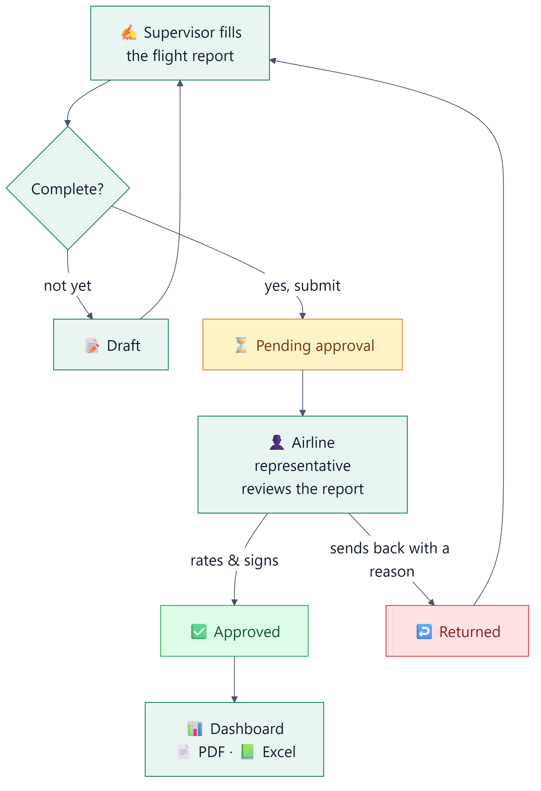
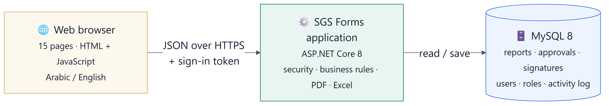

**English** | [العربية](README.ar.md)

# SGS Flight Handling Reports

A web system that records how every flight was handled at the airport, from the moment the aircraft arrives until it
departs. It collects the airline's sign-off on the report instead of on paper, then turns those reports into figures and
dashboards that managers can act on.

---

## The idea in plain words

Picture a ground-handling supervisor at Riyadh airport. A flight has just landed and been handled. Before walking away,
the supervisor opens the system on a tablet or PC and records what happened: arrival and departure times, passengers in
each class, bags by type, wheelchairs, gate, buses, and any delay with its reason. An unfinished report is saved as a
draft; a complete one is submitted straight away.

Next, the airline representative reviews the report on the same device, rates the service from one to five stars and
signs on the screen with a finger. If something is wrong, they send the report back to the supervisor with a reason; the
supervisor corrects it and submits it again.

On the other side, management sees all of this in one place: how many flights were handled, how many reports are waiting
for approval, how satisfied the airlines are, and which station or airline needs attention. Any of it can be downloaded
as Excel or PDF.

<p align="center">
  
</p>

---

## What's in the system?

**Arrival and departure reports.** The core of the system: one form per flight covering passengers, bags, boarding,
delays and staff productivity, with totals calculated automatically.

**Coordination sheets.** A timeline of the aircraft's full turnaround: 24 activities from on-block to push-back, the
actual start and end time of each one, a bus log, and the GAIN time calculation.

**Airline approval.** Star rating, remarks and an electronic signature, stored with the report and printed on its PDF.

**Lists.** Pending approval, drafts, returned, approved and coordination. Each list has instant search, filters by date,
airport and airline, and 50 reports per page with page navigation.

**Dashboard.** Key figures and charts: reports over time, arrivals versus departures, by station, by airline, and the
customer-satisfaction breakdown.

**Export.** PDF for any report. For Excel, a dialog lets you choose exactly what you want (type, status, period,
airline, airport) and shows how many reports match before you download.

**Administration.** Users, roles and airports. Roles are flexible: create a new role and tick its permissions from a list
of 19, with no code changes.

**Activity log.** Every create, edit, submit, approve, return and delete is recorded with who did it and when.

The whole interface is available in **Arabic and English** and works on desktop and mobile.

---

## Who uses it?

| Role | What they do |
|---|---|
| **Handling supervisor** | Fills in reports and coordination sheets for their station, then hands the device to the airline representative for approval |
| **Management** | Follows approved and pending reports and the dashboard across all stations, and exports data |
| **System administrator** | Manages users, roles and airports, and reviews the activity log |

Each user belongs to a station and sees only that station's data, unless they are given the "view all stations"
permission.

---

## How it works inside

The system is a three-tier web application, yet it installs as a single program:

<p align="center">
  
</p>

- **The browser** shows the pages and sends what the user enters.
- **The application** is the brain. It receives each request, checks the user is allowed to do it, applies the business
  rules (for example, only a submitted report can be approved, and an approved report cannot be edited), and produces
  the PDF and Excel files. It also serves the web pages itself, so no separate web server is needed.
- **The database** stores everything: reports, approvals and signatures, users and roles, and the activity log.

At sign-in the user receives a signed digital "ticket" (a JWT) that is sent with every request. The application does
not simply trust the ticket: on every request it checks that the account is still active and its permissions are
unchanged. If an employee is deactivated, changes their password or loses a permission, it takes effect immediately.

### Technologies and why they were chosen

| Part | Technology | Why |
|---|---|---|
| Server | **ASP.NET Core 8** (C#) | Fast, stable, supported by Microsoft, and runs as a standalone program on Windows |
| Database | **MySQL 8** | Free, reliable, with full Arabic support (utf8mb4) |
| Data access | **Entity Framework Core 8** + Pomelo | Creates and updates tables automatically at start-up, and prevents SQL injection |
| Sign-in and permissions | **JWT** + **BCrypt** password hashing | No password is ever stored as-is, and permissions are checked on every request |
| PDF files | **PDFsharp / MigraDoc** | Formal, well-formatted reports with the logo and signature |
| Excel files | **ClosedXML** | Ready-made sheets with filters and formatting, without installing Office on the server |
| Interface | Plain **HTML + CSS + JavaScript**, no framework | Light, fast and needs no build step; **Chart.js** draws the charts |

### Security at a glance
- Passwords are hashed and cannot be recovered, and must be at least 8 characters.
- Sign-in attempts are limited (10 per minute) to stop password guessing, and failed attempts are logged.
- Everything a user types is displayed as plain text, so no code can be injected into the pages.
- Users see only their station and can do only what their permissions allow. These checks happen on the server, not
  just in the interface.
- A user administrator cannot raise their own permissions, or anyone else's, above their own.
- Secrets (the database password and the ticket-signing key) live outside the code and are never uploaded to GitHub.

---

## What you need to run it

**To run it:**
- A **Windows** PC or server (Windows Server 2019 or later for production, Windows 10/11 for testing).
- **MySQL 8.0**.
- **.NET 8 SDK** if you run it from source, as in this repository. A published build needs nothing installed.

**Server size:** for a team of up to 100 users, a single server holding both the application and the database is
enough, with 4 CPU cores and 16 GB of memory. In load testing, an ordinary PC (Core i5, 32 GB) handled hundreds of
simultaneous users with no errors. Details are in [Server Requirements](Doc/09-Server-Requirements.md).

**Browser:** any modern browser: Chrome, Edge, Safari or Firefox.

---

## Getting started, step by step

**1. Prepare the database.** From the `SQL Deploy` folder, as the MySQL root user, run these in order:

| File | What it does |
|---|---|
| `00_create_database.sql` | Creates the database and a dedicated account for the application (`sgs_app`). Change its password first |
| `01_schema.sql` | Creates the tables |
| `02_seed.sql` | Creates the roles and permissions |
| `02_seed_production.sql` | Creates the airports and the first administrator account. Put in your e-mail and a new password hash (explained in `DEPLOYMENT_GUIDE.md`) |

**2. Add the secret settings.** In the `SGSForms.Api` folder, copy `appsettings.Production.example.json` to
`appsettings.Production.json` and fill in:
- `ConnectionStrings:Default`: the database connection, using the `sgs_app` account.
- `Jwt:Key`: a long random string (at least 32 characters). To generate one in PowerShell:
  `[Convert]::ToBase64String([Security.Cryptography.RandomNumberGenerator]::GetBytes(48))`

This file is never uploaded to GitHub, and each machine keeps its own copy.

**3. Run it.** Double-click `run.bat`, then open **http://localhost:5200**.

> For testing only: to get ready-made demo accounts on an empty database, add the setting `Seed__DemoUsers=true`.
> Never use it in production, because the demo passwords are publicly known.

**To deploy to a server,** build a self-contained copy that needs no .NET installed:
```bash
cd SGSForms.Api
dotnet publish -c Release -r win-x64 --self-contained true -o ../publish
```

---

## Settings

| Setting | Where | Description |
|---|---|---|
| `ConnectionStrings:Default` | `appsettings.Production.json` or the environment variable `ConnectionStrings__Default` | Database connection |
| `Jwt:Key` | `appsettings.Production.json` or `Jwt__Key` | Key that signs the sign-in tickets. Required; the application will not start without it |
| `Urls` | `appsettings.json` | Address and port (default `http://localhost:5200`) |
| `Seed:DemoUsers` | `appsettings.json` | Demo accounts. Always `false` in production |
| `ReverseProxy:KnownProxies` | `appsettings.json` | Address of IIS or nginx when the application runs behind a reverse proxy |
| `AllowedHosts` | `appsettings.json` | The real host name in production |

---

## What's in this repository

```
SGSForms.Api/          The application
  ├── Program.cs         Entry point: security and configuration
  ├── SGSForms/Api/      Code: Controllers · Services · Entities · Auth · Migrations
  └── Forms Source/      Interface: 15 pages + nav.js
lib/                   Libraries the application depends on
SQL Deploy/            Database scripts and installation guide
Doc/                   Full technical documentation (Markdown + Word)
run.bat                One-click start
```

---

## Technical documentation

Everything is in the [Doc](Doc/README.md) folder: high-level and low-level design, architecture, network and data-flow
diagrams, the database design, server requirements, the user acceptance test (UAT) form, and the code review report.
